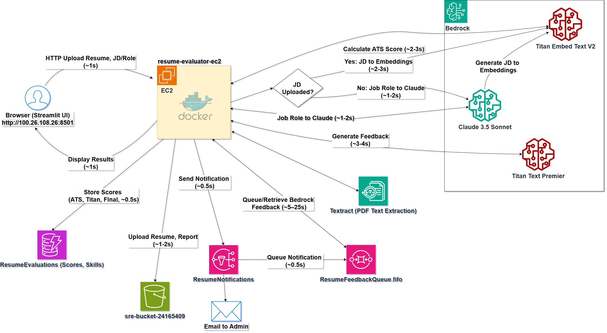
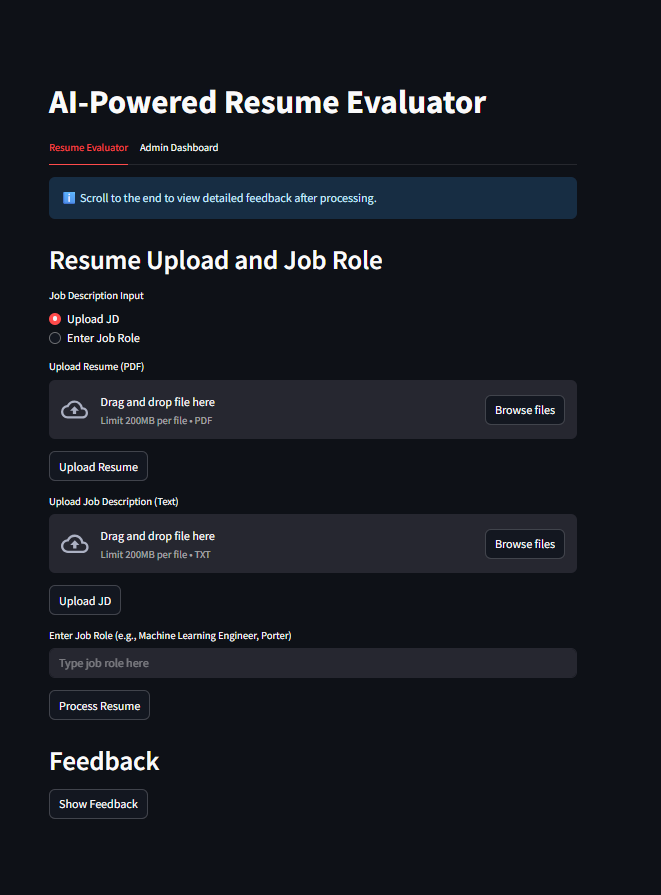
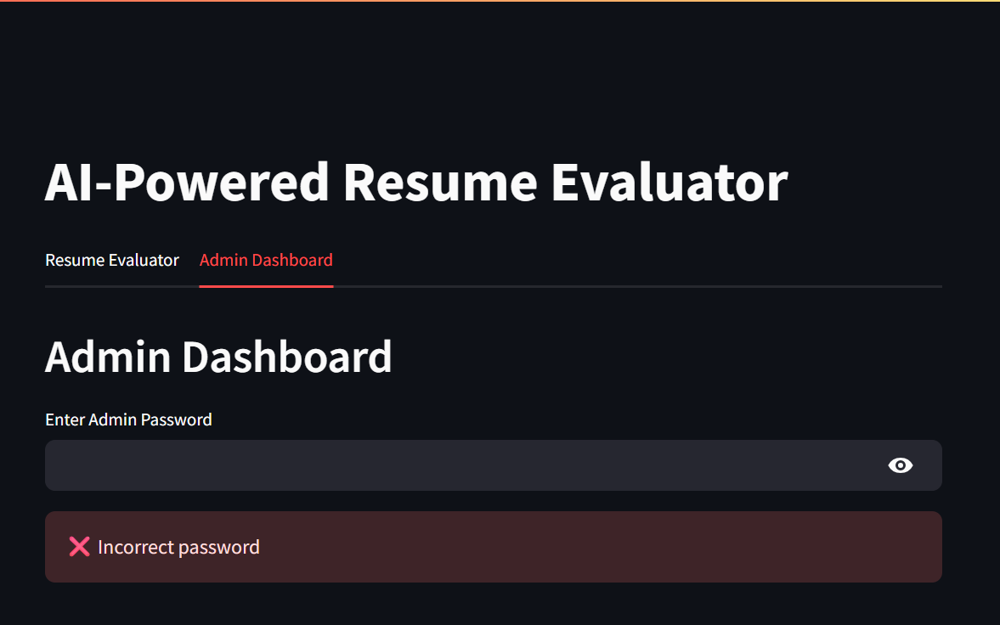

# 🤖 AI-Powered Resume Evaluator on AWS

A cloud-based resume evaluation app using AWS to assess job compatibility for seekers and recruiters.

---

## 🚀 Project Highlights

- 📄 **Automated Resume Evaluation**: Evaluates resumes against job descriptions with AI-driven ATS scoring and feedback.  
- 🌐 **Dual-User Support**: Assists job seekers in refining resumes and recruiters in screening candidates efficiently.  
- ⚙️ **AWS Integration**: Utilizes 7 AWS services for a scalable, cost-efficient deployment.  
- 🧠 **AI-Powered Insights**: Leverages Bedrock for embeddings and Claude for JD generation.  
- 📊 **Admin Dashboard**: Offers real-time evaluation insights via Streamlit.

---

## 🛠️ Technologies Used

| Tool/Library     | Purpose                                                                 |
|------------------|-------------------------------------------------------------------------|
| Python           | Core language for app logic and scripts                                 |
| Streamlit        | Front-end UI for user interaction                                       |
| boto3            | AWS SDK for EC2, S3, DynamoDB, SNS, SQS, Bedrock, Textract              |
| scikit-learn     | Cosine similarity for ATS scoring                                       |
| numpy            | Numerical operations for embeddings                                     |
| pandas           | Data handling in the admin dashboard                                    |
| python-decouple  | Secure management of environment variables                              |
| AWS EC2          | Hosts the app (`resume-evaluator-ec2`)                                  |
| AWS S3           | Stores resumes and reports (`sre-bucket-24165409`)                      |
| AWS DynamoDB     | Manages evaluation data (`ResumeEvaluations`)                           |
| AWS SNS          | Sends notifications (`ResumeNotifications`)                             |
| AWS SQS          | Queues feedback requests (`ResumeFeedbackQueue.fifo`)                   |
| AWS Bedrock      | Powers AI models (Claude, Titan Embed, Titan Premier)                   |
| AWS Textract     | Extracts text from resume PDFs                                          |
| Docker           | Containerizes the application                                           |

---

## 🧠 Skills Demonstrated

- 🏗️ **Cloud Engineering**: Multi-service AWS architecture with EC2, S3, etc.  
- 🤖 **AI/ML Deployment**: Integrated Bedrock models for NLP and embeddings  
- 🧰 **Back-End Development**: SQS polling, Textract parsing, DynamoDB storage  
- 🎨 **Front-End Development**: Streamlit interface for two user roles  
- 🧱 **Infrastructure Automation**: Docker setup with AWS IAM & security groups  

---

## 🌐 Architecture Overview

The app runs on EC2 (`resume-evaluator-ec2`, `http://100.26.108.26:8501`), where users upload resumes and job descriptions via Streamlit.

- 📝 Textract extracts text from resumes
- 🧠 Bedrock (Claude, Titan) generates JDs and feedback
- 📬 SQS handles feedback queueing
- 📦 DynamoDB stores evaluation results
- ☁️ S3 stores resumes and reports
- 🔔 SNS sends user notifications

🧱 Docker is used for containerization. The app runs within the AWS free tier.

---

## 📊 Results Summary

- ⏱️ **Latency**:
  - Text extraction: ~47–48s
  - ATS scoring: ~2–3s
  - Feedback generation: ~3–4s
  - SQS polling: ~5–25s
- 🛡️ **Challenges Mitigated**:
  - Textract errors in 2/10 cases resolved with regex fallback
  - Optimized SQS polling frequency
- 💰 **Cost Efficiency**: Runs on AWS Free Tier (~$0–$5/month)

---

## 🖼️ Visual Insights

### 🧩 Architecture Diagram  


### 💼 Main UI  


### 📊 Admin Dashboard  


---

## 💻 Compute & Infrastructure

- **AWS Services**:
  - EC2: `resume-evaluator-ec2`
  - S3: `sre-bucket-24165409`
  - DynamoDB: `ResumeEvaluations`
  - SNS: `ResumeNotifications`
  - SQS: `ResumeFeedbackQueue.fifo`
  - Bedrock (Claude, Titan)
  - Textract

- **Deployment Strategy**: Dockerized on EC2  
- **Runtime**: Python 3.9+ on EC2, serverless Bedrock for inference

---

## 🧪 Try It Yourself

- 🌐 **Web Access**:  
  http://100.26.108.26:8501 *(Ensure EC2 is running)*

- 💻 **Local Deployment**:

### 🔧 Getting Started

#### 1️⃣ Clone the Repository
```bash
git clone https://github.com/your-username/ai-powered-resume-evaluator.git
cd ai-powered-resume-evaluator/local-workspace
```
2️⃣ Install Dependencies
```bash
Copy code
pip install -r requirements.txt
```
3️⃣ Set Up Environment Variables
```bash
Copy code
cp .env.example .env
Edit .env:

env
Copy code
AWS_ACCESS_KEY_ID=your_access_key
AWS_SECRET_ACCESS_KEY=your_secret_key
S3_BUCKET_NAME=sre-bucket-24165409
SQS_QUEUE_URL=https://sqs.us-east-1.amazonaws.com/<account_id>/ResumeFeedbackQueue
SNS_TOPIC_ARN=arn:aws:sns:us-east-1:<account_id>:ResumeNotifications
```
4️⃣ Run Locally
```bash
Copy code
streamlit run app.py
Visit http://localhost:8501
```
5️⃣ Deploy on AWS (Optional)
Launch EC2 instance (t2.micro)

Open TCP port 8501 + SSH in security group

```bash
Copy code
streamlit run app.py --server.port 8501
```
🤝 Contributions
Contributions welcome!
Please fork the repo, open issues, or submit pull requests.

Let’s build a smarter resume screening future! 🌟
